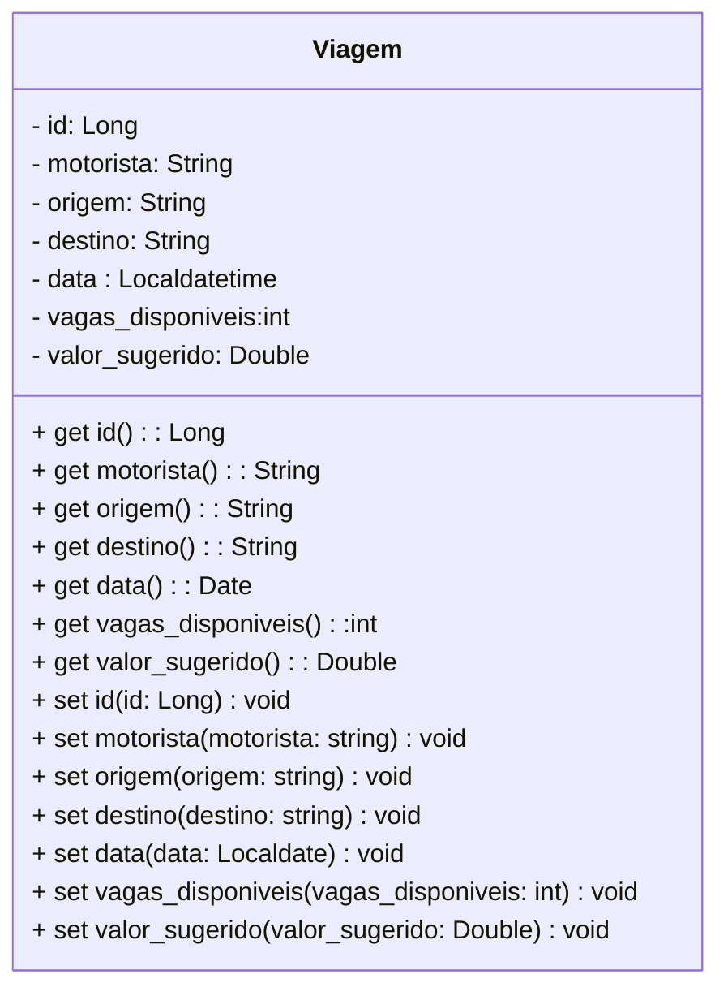
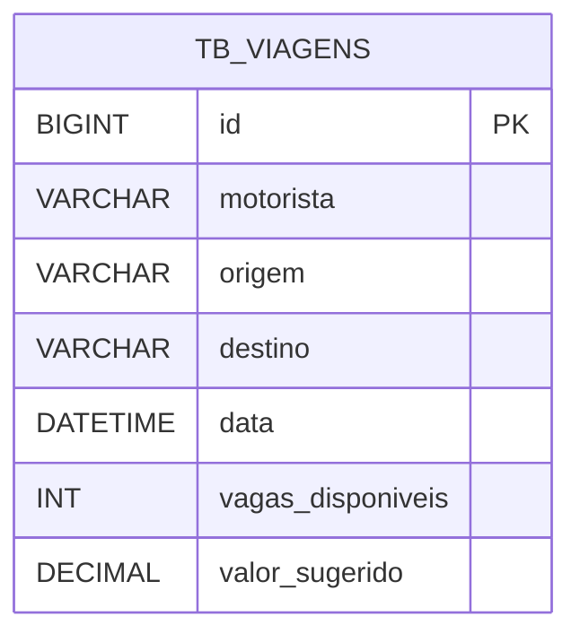

# Projeto-Carona - Backend

 

    

  

## 1. Descrição

Este projeto é a implementação do Backend para a entidade principal Viagem (Carona) do sistema de Caronas Compartilhadas. O objetivo é construir uma API REST completa, que gerencie o ciclo de vida dessa entidade através das operações básicas de CRUD (Create, Read, Update, Delete).

A entidade Viagem é o coração da funcionalidade de Publicação e Busca de Rotas, permitindo que motoristas cadastrem suas rotas e que passageiros encontrem viagens compatíveis, conforme as principais funcionalidades de um sistema de caronas compartilhadas.

------

## 2. Sobre esta API

Descreva brevemente a API que foi construída

### 2.1. Principais Funcionalidades

1. Liste as principais funcionalidades e as features especiais do sistema

------

## 3. Diagrama de Classes

------

## 4. Diagrama Entidade-Relacionamento (DER)

------

## 5. Tecnologias utilizadas

| Item                           | Descrição         |
| ------------------------------ | ----------------- |
| **Servidor**                   |      Tomcat       |
| **Linguagem de programação**   |        Java       |
| **Framework**                  |    Spring Boot    |
| **Ambiente de Desenvolvimento**| Spring Tool Suite |
| **ORM**                        |     Hibernate     |
| **Banco de dados Relacional**  |       MySQL       |
| **Cliente REST para Testes**   |     Insomnia      |

------

## 6. Configuração e Execução

### Pré-requisitos
- Java Development Kit (JDK)
- 17+Maven (ou Gradle)
- MySQL Server instalado e em execução
- Spring Tool Suite (STS) ou outra IDE (IntelliJ, Eclipse)

### Configuração do Banco de Dados
- Crie um banco de dados vazio no seu MySQL. Exemplo: caronas_db.
- Configure as credenciais de acesso no arquivo application.properties (ou application.yml) do projeto:
  Properties
  > Exemplo para application.properties
  - spring.datasource.url=jdbc:mysql://localhost:3306/caronas_db
  - spring.datasource.username=seu_usuario_mysql
  - spring.datasource.password=sua_senha_mysql
  - spring.jpa.hibernate.ddl-auto=update
  - spring.jpa.show-sql=true
* Nota: O spring.jpa.hibernate.ddl-auto=update garantirá que o Hibernate (o ORM) crie automaticamente a tabela viagem com todos os atributos definidos na Entity, conforme as especificações do projeto.

### Execução
- Clone o Repositório:
    > Bash
    - git clone https://github.com/InovaHer/InovaHer-Projeto-Carona.git
    - cd caronaBack
- Compile e Execute via Terminal (Maven):
    > Bash
    - ./mvnw clean install
    - ./mvnw spring-boot:run
- Execute via IDE (Spring Tool Suite):
    - Importe o projeto como um projeto Maven existente.
    - Localize o arquivo principal da aplicação (geralmente caronaBackApplication.java).
    - Clique com o botão direito e escolha Run As -> Spring Boot App.
    A aplicação será iniciada e estará acessível, por padrão, em http://localhost:8080.

### Testando com Insomnia/Postman
  - Após a execução, utilize o Insomnia (ou Postman) para interagir com a API, utilizando os endpoints listados na Seção 2 (ex: POST para http://localhost:8080/viagens).
